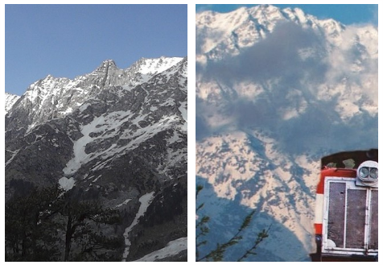

<!-- markdownlint-disable no-inline-html -->

# Extras

## The Mountains

A thread dedicated to sharing pictures, putting in words the appreciation for my backyard, the mighty Himalayas:
The last frontier, the king of all mountains.
<a class="" href="../lists/#the-mountain-thread"><b><u>Link</u></b></a>

Himalayas
Mountains
Himachal Pradesh

## Reading List

- [Thus Spake Zarathustra - Friedrich Nietzsche](https://www.goodreads.com/book/show/51893.Thus_Spoke_Zarathustra):
    A book for None and All. Controversial and riveting, but the writing style takes some getting used to.
    A tremendously influential philosophical work of the 19th century. `Philosophy` `Morality`

## Podcasts

- [BBC - Thinking Allowed](http://www.bbc.co.uk/programmes/b006qy05): New research on how society works. `Sociology`
- [Matters of State](http://www.mattersofstate.org): A podcast on International realtions and politics.
    `International Relations` `Politics`

[^1]: Last Updated: `2018-04-22`
